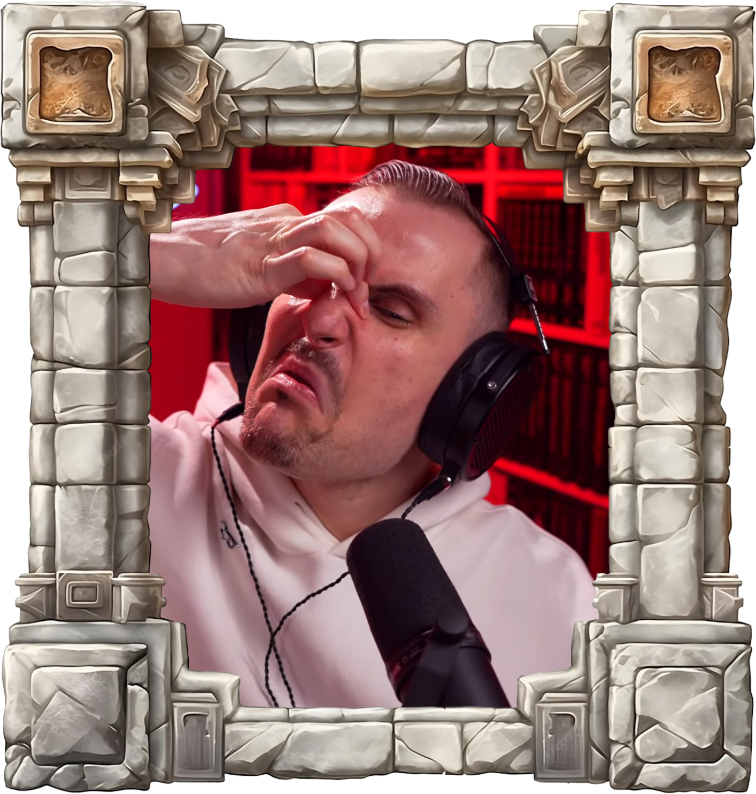

# Allotopia

<table>
    <tr>
        <td>
            
        </td>
        <td>
            
        </td>
    </tr>
</table>

Witaj w kompletnym archiwum poświęconym polskiemu ludologowi, Krzysztofowi M. Majowi! Znajdziesz tutaj transkrypcje filmów, streamów oraz wywiadów z udziałem dra Maja:
- 📚 w formie [markdown](Markdown), wygodnej do przeglądania, 
- 📜 w formie [plaintext](Plaintext).

Dzięki niezwykłej potędze **sztucznej inteligencji**, każde słowo zostaje **na bieżąco** udokumentowane w tej oto kronice. Na przykład:

> Pan Krzysztof M. Maj wypowiedział w czasie streama "[🔴 Bear with me, niedźwiedź ze mną — WARHAMMER 3 Kostaltyn #2](https://github.com/TromtadrackaLogorea/Allotopia/blob/master/Markdown/Total%20War%20Warhammer%203/Bear%20with%20me%20nied%C5%BAwied%C5%BA%20ze%20mn%C4%85%20WARHAMMER%203%20Kostaltyn%202.md#t3715)" w momencie [1:01:54](https://www.youtube.com/watch?v=yjpBzYQVOcw&t=3714s) te oto słowa:
>
>> Bralczyk nie jest normatywistą, był otwarty na zaproszenie, na wprowadzenie "poszłem" jako legitnego słowa. No to nie znaczy, że jest normatywistą, tylko znaczy, że jest debilem.

> Pan Krzysztof M. Maj rzekł podczas "[🔴 Kto ocenia oceniających? | LIVE #33](https://github.com/TromtadrackaLogorea/Allotopia/blob/master/Markdown/QA/Kto%20ocenia%20oceniaj%C4%85cych%20LIVE%2033.md#t10154)" w momencie [2:49:14](https://www.youtube.com/watch?v=cK7kQh77ygw&t=10154):
>
>> Więc i Bralczyk i Miodek mnie drażnią potwornie, zresztą strasznie, czasami wchodzi takie dziaderstwo, że... Ja mam alergię jednak na takie dziaderskie myślenie, bo spotkałem w życiu paru profesorów, którzy są jak najdalej na spektrum od dziaderstwa, no i nie jestem w stanie potem tego zaakceptować.

Kronika zawiera także wiele informacji o historii samego ludologa, in exemplum:
- Trapi go chroniczne zapalenie jelita ([źródło](https://www.youtube.com/watch?v=EaSYhXxaCwk&t=1904s))
- Ma genetyczne przewężenie nerki ([źródło](https://www.youtube.com/watch?v=37NWlyITPD8&t=4669))
- Wysiadła mu wątroba ([źródło](https://www.youtube.com/watch?v=rXXF_3f_U4k&t=18687))
- Miał złamaną, i to ostro, rękę; cierpi na astmę wysiłkową ([źródło](https://www.youtube.com/watch?v=TTa-380ajUY&t=2821))
- Kiedyś kość ramienna wbiła mu się w staw i odcięła dwa z trzech dopływów krwi do stawu ([źródło](https://www.youtube.com/watch?v=x4qaLcCMEow&t=3201))
- Ma chorobę lokomocyjną ([źródło](https://www.youtube.com/watch?v=cK7kQh77ygw&t=18171))
- Cierpi na trądzik różowaty ([źródło](https://www.youtube.com/watch?v=DxHthwfH040&t=14680))
- Ma dyskalkulię ([źródło](https://www.youtube.com/watch?v=uLnwUON3AxA&t=2533))
- Był człowiekiem, który wielokrotnie wpadał w szał ([źródło](https://www.youtube.com/watch?v=Y8SrdmHvH00&t=8120))
- Miał stany depresyjne ([źródło](https://www.youtube.com/watch?v=amsrszmRhQY&t=2298))
- Od dziecka ma problemy z pamięcią ([źródło](https://www.youtube.com/watch?v=kppzw7GfPl0&t=15797s))

 

- Odradza walki z jego mamą, która była dziekanem ([źródło](https://www.youtube.com/watch?v=cyUdPUnJe74&t=27848))
- Otrzymywał oceny niedostateczne z lektur w szkole ([źródło](https://www.youtube.com/watch?v=lSQVWcWy4L4&t=6135))
- Nie zdał matury z języka polskiego i ma doktorat z literaturoznawstwa ([źródło](https://www.youtube.com/watch?v=f5uBVyRilCY&t=8358))
- Osiągnął swój cel przejścia przez polonistykę bez przeczytania Pana Tadeusza oraz Dziadów ([źródło](https://www.youtube.com/watch?v=x8IefhhaVxk&t=4412s))
- Czekał 10 lat na opublikowanie jego artykułu naukowego ([źródło](https://www.youtube.com/watch?v=Yk2QzCZQ5zE&t=1427s))

## Inne ciekawe cytaty:

> [🔴 Baśń o dwóch Rannich, co ukradły księżyc — ELDEN RING: SHADOW OF THE ERDTREE Livestream #5](https://github.com/TromtadrackaLogorea/Allotopia/blob/master/Markdown/Elden%20Ring/Ba%C5%9B%C5%84%20o%20dw%C3%B3ch%20Rannich%20co%20ukrad%C5%82y%20ksi%C4%99%C5%BCyc%20ELDEN%20RING%20SHADOW%20OF%20THE%20ERDTREE%20Livestream%205.md#t1495), moment [24:55](https://www.youtube.com/watch?v=K2IKluPDI78&t=1495):
 >> Michu Brc pyta, "jak sobie pokonać strach przed igłą i pobieraniem krwi. Mam badania do medycyny pracy i strach paraliżuje". Moja strategia jest taka, że myślę o... **najbardziej rozerotyzowanych momentach mojego życia w sytuacjach medycznych, pobierania krwi albo wyrywania zębów**, działa. Ewentualnie można najdzikszą fantazję sobie uruchomić wtedy. Działa. Naprawdę działa. Trzeba krótko mówiąc stymulować inny obszar mózgu. Przysięgam, zawsze to robię. Trzeba tylko pilnować, żeby nie przesadzić w drugą stronę, wiecie, o czym mówię.
 